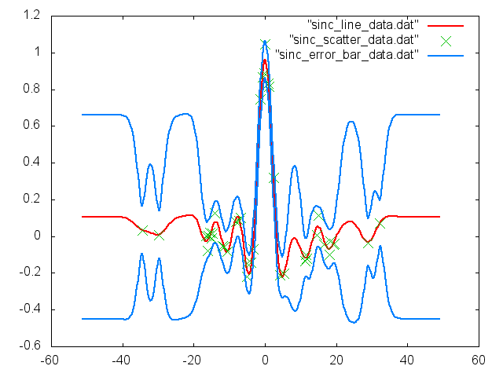
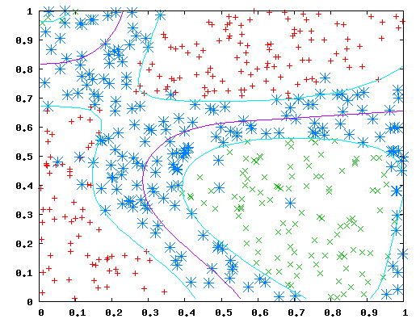
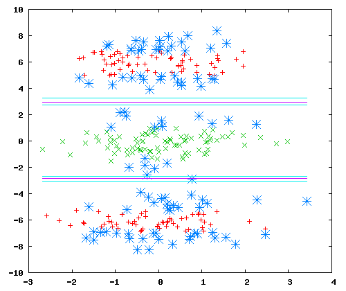
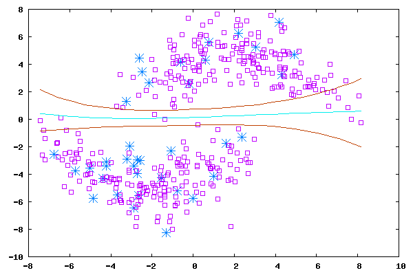
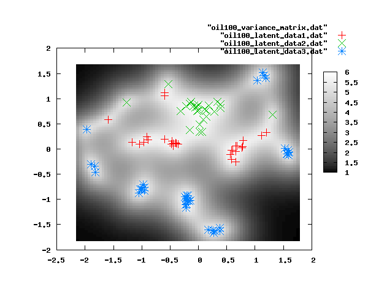
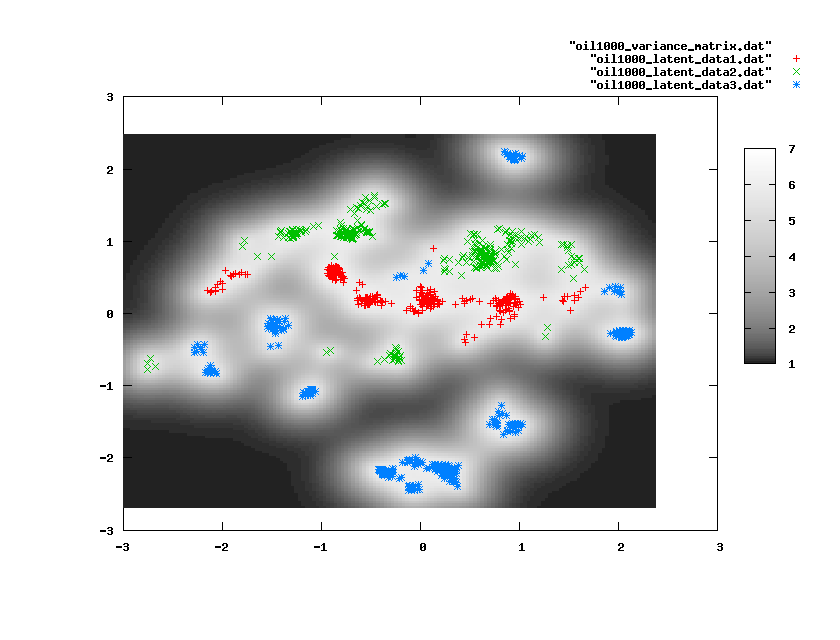
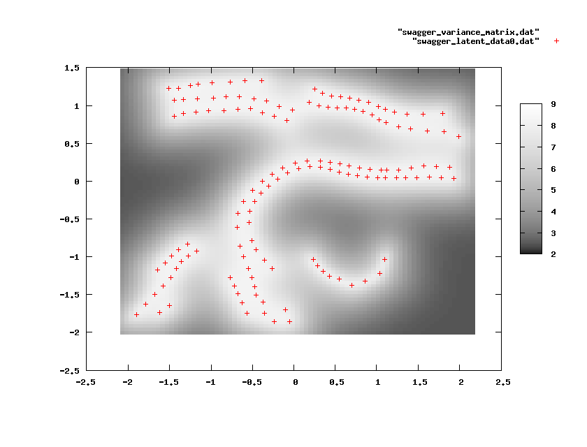
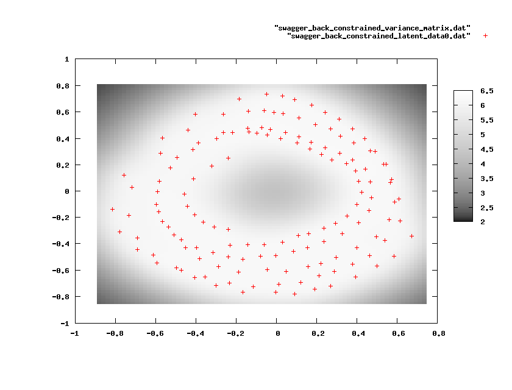
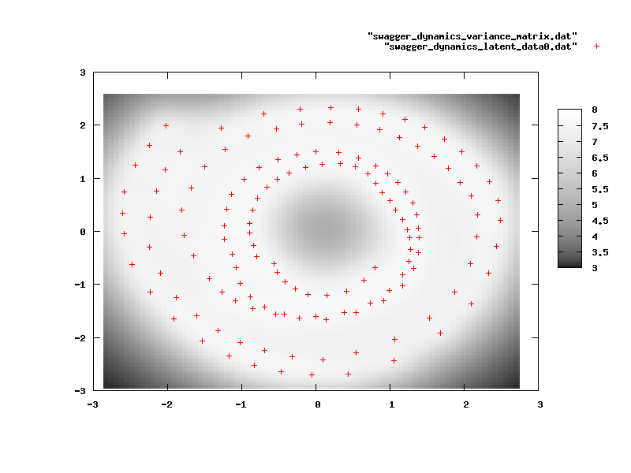

GPc
===

Gaussian process code in C++ including some implementations of GP-LVM and IVM.


Gaussian Process Software
=========================

This page describes how to compile and gives some examples of use of the C++ Gaussian Process code. 

### Release Information

Current release is 0.001.

### Design Philosophy

The software is written in C++ to try and get a degree of flexibility in the models that can be used without a serious performance hit. This was difficult to do in MATLAB as users who have tried version 1 (which was fast but inflexible) and version 2 (which was flexible but slow) of the MATLAB software will appreciate.

The software is mainly written in C++ but relies for some functions on FORTRAN code by other authors and the LAPACK and BLAS libraries. 

As well as the C++ code some utilities are supplied in the corresponding MATLAB code for visualising the results. 

## Compiling the Software

The software was written with gcc on ubuntu.

Part of the reason for using gcc is the ease of interoperability with FORTRAN. The code base makes fairly extensive use of FORTRAN so you need to have g77 installed.
The software is compiled by writing 

```sh
$ make gp
```

at the command line. Architecture specific options are included in the `make.ARCHITECTURE` files. Rename the file with the relevant architecture to `make.inc` for it to be included.

### Optimisation

One of the advantages of interfacing to the LAPACK and BLAS libraries is that they are often optimised for particular architectures. 


## General Information

The way the software operates is through the command line. There is one executable, `gp`. Help can be obtained by writing 

```sh
$ ./gp -h
```

which lists the commands available under the software. Help for each command can then be obtained by writing, for example, 

```sh
$ ./gp learn -h
```

All the tutorial optimisations suggested take less than 1/2 hour to run on my less than 2GHz Pentium IV machine. The first oil example runs in a couple of minutes. Below I suggest using the highest verbosity options `-v 3` in each of the examples so that you can track the iterations.

## Examples

The software loads in data in the <a href="http://svmlight.joachims.org/">SVM light</a> format. This is to provide compatibility with other <a href="/~neill/ivmcpp/">Gaussian Process software</a>. Anton Schwaighofer has written <a href="http://staffwww.dcs.shef.ac.uk/people/N.Lawrence/software/svml_toolbox.html"> a package</a> which can write from MATLAB to the SVM light format.

## One Dimensional Data Data


Provided with the software, in the `examples` directory, is a one dimensional regression problem. The file is called `spgp1d.svml`. 

First we will learn the data using the following command,

```sh
$ ./gp -v 3 learn -# 100 examples/sinc.svml sinc.model
```

The flag `-v 3` sets the verbosity level to 3 (the highest level) which causes the iterations of the scaled conjugate gradient algorithm to be shown. The flag `-# 100` terminates the optimisation after 100 iterations so that you can quickly move on with the rest of the tutorial.

The software will load the data in `sinc.svml`. The labels are included in this file but they are <i>not</i> used in the optimisation of the model. They are for visualisation purposes only.

### Gnuplot

The learned model is saved in a file called `sinc.model`. This file has a plain text format to make it human readable. Once training is complete, the learned covariance function parameters of the model can be displayed using 


```sh
$ ./gp display sinc.model
```

```sh
Loading model file.
... done.
Standard GP Model: 
Optimiser: scg
Data Set Size: 40
Kernel Type: 
Scales learnt: 0
X learnt: 0
Bias: 0.106658 

Scale: 1 

Gaussian Noise: 
Bias on process 0: 0
Variance: 1e-06
compound kernel:
rbfinverseWidth: 0.198511
rbfvariance: 0.0751124
biasvariance: 1.6755e-05
whitevariance: 0.00204124
```

Notice the fact that the covariance function is composed of an RBF kernel, also known as squared exponential kernel or Gaussian kernel; a bias kernel, which is just a constant, and a white noise kernel, which is a diagonal term. This is the default setting, it can be changed with flags to other covariance function types, see `./gp learn -h` for details.

For your convenience a `gnuplot` file may generated to visualise the data. First run

```sh
$ ./gp gnuplot -r 400 examples/sinc.svml sinc.model sinc
```

The `sinc` supplied as the last argument acts as a stub for gnuplot to create names from, so for example (using gnuplot vs 4.0 or above), you can write

```sh
$ gnuplot sinc_plot.gp
```

Note: for this to work on OSX you may have to 

```sh
$ brew install gnuplot --with-x
```

Then you should obtain the plot shown below
<center><br>
Gaussian process applied to sinc data.</center><br>

The other files created are `sinc_error_bar_data.dat`, which produces the error bars and `sinc_line_data.dat` which produces the mean as well as `sinc_scatter_data.dat` which shows the training data.

### Other Data

You might also want to try a larger data set.

```sh
$ ./gp -v 3 learn -# 100 examples/spgp1d.svml spgp1d.model
```

### MATLAB and OCTAVE

While MATLAB can be slow (and very expensive for non-academic users) it can still be a lot easier to code the visualisation routines by building on MATLAB's graphics facilities. To this end you can load in the results from the MATLAB/OCTAVE GP toolbox for further manipulation. You can download the toolbox from <a href="/~neill/gp">here</a>. Once the relevant toolboxes (you need all the dependent toolboxes) are downloaded you can visualise the results in MATLAB using

```matlab
>> [y, X] = svmlread('sinc.svml')
>> gpReadFromFile('sinc.model', X, y)
>>
```

where we have used the <a href="http://staffwww.dcs.shef.ac.uk/people/N.Lawrence/software/svml_toolbox.html">SVML toolbox</a> of Anton Schwaighofer to load in the data.

IVM Software
============

This page describes how to compile and gives some examples of use of the C++ Informative Vector Machine Software (IVM).

### Design Philosophy

The software is written in C++ to try and get a degree of flexibility in the models that can be used without a serious performance hit. 

The software is mainly written in C++ but relies for some functions on FORTRAN code by other authors and the LAPACK and BLAS libraries. 

## Compiling the Software

The software was written with gcc vs 3.2.2. There are definitely Standard Template Library issues on Solaris with gcc 2.95, so I suggest that at least version 3.2 or above is used.

Part of the reason for using gcc is the ease of interoperability with FORTRAN. The code base makes fairly extensive use of FORTRAN so you need to have g77 installed.
The software is compiled by writing 

```sh
$ make ivm
```

at the command line. Architecture specific options are included in the `make.ARCHITECTURE` files. Rename the file with the relevant architecture to `make.inc` for it to be included.

### Optimisation

One of the advantages of interfacing to the LAPACK and BLAS libraries is that they are often optimised for particular architectures. The file `make.atlas` includes options for compiling the ATLAS optimised versions of lapack and blas that are available on a server I have access to. These options may vary for particular machines.

### Cygwin

For Windows users the code compiles under cygwin. However you will need version s of the lapack and blas libraries available (see <a href="http://www.netlib.org">www.netlib.org</a>. This can take some time to compile, and in the absence of any pre-compiled versions on the web I've provided some pre-compiled versions you may want to make use of (see the cygwin directory). Note that these pre-compiled versions are <i>not</i> optimised for the specific architecture and therefore do not give the speed up you would hope for from using lapack and blas.

### Microsoft Visual C++

As of Release 0.101 the code compiles under Microsoft Visual Studio 7.1. A project file is provided in the current release in the directory `MSVC/ivm`. The compilation makes use of f2c versions of the FORTRAN code and the C version of LAPACK/BLAS, CLAPACK. Detailed instructions on how to compile are in the readme.msvc file. Much of the work to convert the code (which included ironing out several bugs) was done by William V. Baxter for the GPLVM code. 

## General Information

The way the software operates is through the command line. There is one executable, `ivm`. Help can be obtained by writing 

```sh
$ ./ivm -h
```

which lists the commands available under the software. Help for each command can then be obtained by writing, for example, 

```sh
$ ./ivm learn -h
```

All the tutorial optimisations are suggested take less than 1/2 hour to run on my less than 2GHz Pentium IV machine. The first oil example runs in a couple of minutes. Below I suggest using the highest verbosity options `-v 3` in each of the examples so that you can track the iterations.

## Bugs

Victor Cheng writes:

<i>" ... I've tested your IVM C++ Gaussian Process tool (IVMCPP0p12 version). It is
quite useful. However, the gnuplot function seems has a problem. Every time
I type the command: "Ivm gnuplot traindata name.model", an error comes out
as: "Unknown noise model!". When I test this function with IVMCPP0p11 IVM,
its fine, but IVMCPP0p11 has another problem that it gives "out of memory"
error in test mode! So I use two vesions simultaneously. "</i> 

I'm working (as of 31/12/2007) on a major rewrite, so it's unlikely that these bugs will be fixed in the near future, however if anyone makes a fix I'll be happy to incorporate it! Please let me know.


## Examples

The software loads in data in the <a href="http://svmlight.joachims.org/">SVM light</a> format. Anton Schwaighofer has written <a href="http://staffwww.dcs.shef.ac.uk/people/N.Lawrence/software/svml_toolbox.html"> a package</a> which can write from MATLAB to the SVM light format.

## Toy Data Sets

In this section we present some simple examples. The results will be visualised using `gnuplot`. It is suggested that you have access to `gnuplot` vs 4.0 or above.

Provided with the software, in the `examples` directory, are some simple two dimensional problems. We will first try classification with these examples.

The first example is data sampled from a Gaussian process with an RBF kernel function with inverse width of 10. The input data is sampled uniformly from the unit square. This data can be learnt with the following command.

```sh
$ ./ivm -v 3 learn -a 200 -k rbf examples/unitsquaregp.svml unitsquaregp.model
```

The flag `-v 3` sets the verbosity level to 3 (the highest level) which causes the iterations of the scaled conjugate gradient algorithm to be shown. The flag `-a 200` sets the active set size. The kernel type is selected with the flag `-k rbf`. 

### Gnuplot

The learned model is saved in a file called `unitsquaregp.model`. This file has a plain text format to make it human readable. Once training is complete, the learned kernel parameters of the model can be displayed using 

```sh
$ ./ivm display unitsquaregp.model
```

```sh
Loading model file.
... done.
IVM Model:
Active Set Size: 200
Kernel Type:
compound kernel:
rbfinverseWidth: 12.1211
rbfvariance: 0.136772
biasvariance: 0.000229177
whitevariance: 0.0784375
Noise Type:
Probit noise:
Bias on process 0: 0.237516
```

Notice the fact that the kernel is composed of an RBF kernel, also known as squared exponential kernel or Gaussian kernel; a bias kernel, which is just a constant, and a white noise kernel, which is a diagonal term. The bias kernel and the white kernel are automatically added to the rbf kernel. Other kernels may also be used, see `ivm learn -h` for details.

For this model the input data is two dimensional, you can therefore visualise the decision boundary using

```sh
$ ./ivm gnuplot examples/unitsquaregp.svml unitsquaregp.model unitsquaregp
```

The `unitsquaregp` supplied as the last argument acts as a stub for gnuplot to create names from, so for example (using gnuplot vs 4.0 or above), you can write

```sh
$ gnuplot unitsquaregp_plot.gp
```

and obtain the plot shown below
<center><br>
The decision boundary learnt for the data sampled from a Gaussian process classification. Note the active points (blue stars) typically lie along the decision boundary.</center><br>

The other files created are `oil100_variance_matrix.dat`, which produces the grayscale map of the log precisions and `oil100_latent_data1-3.dat` which are files containing the latent data positions associated with each label.

### Feature Selection

Next we consider a simple ARD kernel. The toy data in this case is sampled from three Gaussian distributions. To separate the data only one input dimension is necessary. The command is run as follows,

```sh
$ ./ivm learn -a 100 -k rbf -i 1 examples/ard_gaussian_clusters.svml ard_gaussian_clusters.model
```

Displaying the model it is clear that it has selected one of the input dimensions, 

```sh
Loading model file.<br>
... done.<br>
IVM Model:<br>
Active Set Size: 100<br>
Kernel Type:<br>
compound kernel:<br>
rbfardinverseWidth: 0.12293<br>
rbfardvariance: 2.25369<br>
rbfardinputScale: 5.88538e-08<br>
rbfardinputScale: 0.935148<br>
biasvariance: 9.10663e-07<br>
whitevariance: 2.75252e-08<br>
Noise Type:<br>
Probit noise:<br>
Bias on process 0: 0.745098

```

Once again the results can be displayed as a two dimensional plot,

```sh
$ ./ivm gnuplot examples/ard_gaussian_clusters.svml ard_gaussian_clusters.model ard_gaussian_clusters
```

<center><br>
The IVM learnt with an ARD RBF kernel. One of the input directions has been recognised as not relevant.
</center>


## Semi-Supervised Learning

The software also provides an implementation of the null category noise model described in <a href="http://ml.sheffield.ac.uk/~neil/cgi-bin/publications/bibpage.cgi?keyName=Lawrence:semisuper04">Lawrence and Jordan</a>. 

The toy example given in the paper is reconstructed here. To run it type

```sh
$ ./ivm learn -a 100 -k rbf examples/semisupercrescent.svml semisupercrescent.model
```

The result of learning is

```sh
Loading model file.
... done.
IVM Model:
Active Set Size: 100
Kernel Type:
compound kernel:
rbfinverseWidth: 0.0716589
rbfvariance: 2.58166
biasvariance: 2.03635e-05
whitevariance: 3.9588e-06
Noise Type:
Ncnm noise:
Bias on process 0: 0.237009
Missing label probability for -ve class: 0.9075
Missing label probability for +ve class: 0.9075
```

and can be visualised using

```sh
$ ./ivm gnuplot examples/semisupercrescent.svml semisupercrescent.model semisupercrescent
```

followed by 

```sh
$ gnuplot semisupercrescent_plot.gp
```

The result of the visualisation being,

<center><br>The result of semi-supervised learning on the crescent data. At the top is the result from the null category noise model. The bottom shows the result from training only on the labelled data only with the standard probit noise model. Purple squares are unlabelled data, blue stars are the active set. <center>


GP-LVM Software
===============

This page describes how to compile and gives some examples of use of the C++ Gaussian Process Latent Variable Model Software (GP-LVM) available for <a href="http://ml.sheffield.ac.uk/~neil/cgi-bin/software/downloadForm.cgi?toolbox=gplvmcpp">download here</a>. 

### Release Information

#### Release 0.201

Fixed bug which meant that back constraint wasn't working due to failure to initialise lwork properly for dsysv. 

Fixed bug in gplvm.cpp which meant dynamics wasn't working properly because initialization of dynamics model learning parameter wasn't set to zero.

Thanks to Gustav Henter for pointing out these problems.

#### Release 0.2

In this release we updated the class structure of the gplvm model and
made some changes in the way in which files are stored. This release
is intended as a stopgap before a release version in which fitc, dtc
and variational dtc approximations will be available.

In this release the dynamics model of <a href="http://www.dgp.toronto.edu/~jmwang/gpdm/">Wang <i>et al</i>.</a> has been included. The initial work was done by William V. Baxter, with modifications by me to include the unusual prior Wang suggests in his MSc thesis, scaling of the dynamics likelihood and the ability to set the signal noise ratio. A new example has been introduced for this model below.

As part of the dynamics introduction a new MATLAB toolbox for the GP-LVM has been released. This toolbox, <a href="http://ml.sheffield.ac.uk/~neil/cgi-bin/software/downloadForm.cgi?toolbox=fgplvm">download here</a>, is expected to be the main development toolbox for the GP-LVM in MATLAB.

Version 0.101 was released 21st October 2005.

This release contained modifications by William V. Baxter to enable the code to work with Visual Studio 7.1.

Version 0.1, was released in late July 2005.

This was the original release of the code.

### Design Philosophy

The software is written in C++ to try and get a degree of
flexibility in the models that can be used without a serious
performance hit. This was difficult to do in MATLAB as users who have
tried version 1 (which was fast but inflexible) and version 2 (which
was flexible but slow) of the MATLAB software will appreciate.

The sparsification algorithm has not been implemented in the C++
software so this software is mainly for smaller data sets (up to
around a thousand points).

The software is mainly written in C++ but relies for some functions
on FORTRAN code by other authors and the LAPACK and BLAS libraries.

As well as the C++ code some utilities are supplied in MATLAB code
for visualising the results.

## Compiling the Software

The software was written with gcc vs 3.2.2. There are definitely
Standard Template Library issues on Solaris with gcc 2.95, so I
suggest that at least version 3.2 or above is used.

Part of the reason for using gcc is the ease of interoperability
with FORTRAN. The code base makes fairly extensive use of FORTRAN so
you need to have g77 installed.  The software is compiled by
writing

```sh
$ make gplvm
```

at the command line. Architecture specific options are included in
the `make.ARCHITECTURE` files. Rename the file with the
relevant architecture to `make.inc` for it to be included.

### Optimisation

One of the advantages of interfacing to the LAPACK and BLAS libraries
is that they are often optimised for particular architectures. The
file `make.atlas` includes options for compiling the ATLAS
optimised versions of lapack and blas that are available on a server I
have access to. These options may vary for particular machines.

### Cygwin

For Windows users the code compiles under cygwin. However you will
need version s of the lapack and blas libraries available (see <a
href="http://www.netlib.org">www.netlib.org</a>. This can take some
time to compile, and in the absence of any pre-compiled versions on
the web I've provided some pre-compiled versions you may want to make
use of (see the cygwin directory). Note that these pre-compiled
versions are <i>not</i> optimised for the specific architecture and
therefore do not give the speed up you would hope for from using
lapack and blas.

### Microsoft Visual C++

As of Release 0.101 the code compiles under Microsoft Visual Studio
7.1. A project file is provided in the current release in the
directory `MSVC/gplvm`. The compilation makes use of f2c
versions of the FORTRAN code and the C version of LAPACK/BLAS,
CLAPACK. Detailed instructions on how to compile are in the
readme.msvc file. The work to convert the code (which included ironing
out several bugs) was done by William V. Baxter. Many thanks to Bill
for allowing me to make this available.

## General Information

The way the software operates is through the command line. There is
one executable, `gplvm`. Help can be obtained by writing

```sh
$ ./gplvm -h
```

which lists the commands available under the software. Help for
each command can then be obtained by writing, for example,

```sh
$ ./gplvm learn -h
```

All the tutorial optimisations suggested take less than 1/2 hour to
run on my less than 2GHz Pentium IV machine. The first oil example
runs in a couple of minutes. Below I suggest using the highest
verbosity options `-v 3` in each of the examples so that
you can track the iterations.

## Examples

The software loads in data in the <a
href="http://svmlight.joachims.org/">SVM light</a> format. This is to
provide compatibility with other <a href="https://github.com/SheffieldML/GPmat/">Gaussian
Process software</a>. Anton Schwaighofer has written <a
href="http://staffwww.dcs.shef.ac.uk/people/N.Lawrence/software/svml_toolbox.html"> a package</a>
which can write from MATLAB to the SVM light format.

## Oil Flow Data

In the original NIPS paper the first example was the oil flow data
(see <a href="http://staffwww.dcs.shef.ac.uk/people/N.Lawrence/3PhaseData.html">this
page</a> for details) sub-sampled to 100 points. I use this data a lot
for checking the algorithm is working so in some senses it is not an
independent `proof' of the model.

Provided with the software, in the `examples` directory,
is a sub-sample of the oil data. The file is called
`oilTrain100.svml`.

First we will learn the data using the following command,

```sh
$ ./gplvm -v 3 learn -# 100 examples/oilTrain100.svml oil100.model
```

The flag `-v 3` sets the verbosity level to 3 (the
highest level) which causes the iterations of the scaled conjugate
gradient algorithm to be shown. The flag `-# 100`
terminates the optimisation after 100 iterations so that you can
quickly move on with the rest of the tutorial.

The software will load the data in
`oilTrain100.svml`. The labels are included in this file
but they are <i>not</i> used in the optimisation of the model. They
are for visualisation purposes only.

### Gnuplot

The learned model is saved in a file called
`oil100.model`. This file has a plain text format to make
it human readable. Once training is complete, the learned kernel
parameters of the model can be displayed using

```sh
$ ./gplvm display oil100.model
```

```sh

Loading model file.
... done.
GPLVM Model:
Data Set Size: 100
Kernel Type:
compound kernel:
rbfinverseWidth: 3.97209
rbfvariance: 0.337566
biasvariance: 0.0393251
whitevariance: 0.00267715
```

Notice the fact that the kernel is composed of an RBF kernel, also
known as squared exponential kernel or Gaussian kernel; a bias kernel,
which is just a constant, and a white noise kernel, which is a
diagonal term. This is the default setting, it can be changed with
flags to other kernel types, see `gplvm learn -h` for
details.

For your convenience a `gnuplot` file may generated to
visualise the data. First run

```sh
$ ./gplvm gnuplot oil100.model oil100
```

The `oil100` supplied as the last argument acts as a
stub for gnuplot to create names from, so for example (using gnuplot
vs 4.0 or above), you can write

```sh
$ gnuplot oil100_plot.gp
```

And obtain the plot shown below
<center><br>
Visualisation of 100 points of the oil flow data.</center><br>

The other files created are
`oil100_variance_matrix.dat`, which produces the grayscale
map of the log precisions and `oil100_latent_data1-3.dat`
which are files containing the latent data positions associated with
each label.

### The Entire Oil Data Set

Running the GPLVM for 1000 iterations on all 1000 points of the oil
data leads to the visualisation below.

<center><br>
All 1000 points of the oil data projected into latent space. This visualisation takes overnight to optimise on a Pentinum IV.
</center>

### MATLAB

While MATLAB can be horribly slow (and very expensive for non-academic
users) it is still a lot easier (for me) to code the visualisation
routines by building on MATLAB's graphics facilities. To this end a
new release of the GPLVM code in MATLAB has been provided (vs 2.012
and above) which allows you to load the results of the learning from
the C++ code into MATLAB for further manipulation. You can download
the toolbox from <a
href="http://ml.sheffield.ac.uk/~neil/cgi-bin/software/downloadForm.cgi?toolbox=gplvm">here</a>. Once
the relevant toolboxes (you need the IVM toolbox and the toolboxes on
which it depends: KERN, NOISE, etc.) are downloaded you can visualise
the results in MATLAB using

```matlab
>> gplvmResultsCpp('oil100.model', 'vector')
>>
```

This will load the results and allow you to move around the latent
space visualising (in the form of a line plotted from the vector) the
nature of the data at each point.

## Motion Capture

One popular use of the GPLVM has been in learning of human motion
styles (see <a
href="http://ml.sheffield.ac.uk/~neil/cgi-bin/publications/bibpage.cgi?keyName=Grochow:styleik04&printAbstract=1">Grochow
<i>et al.</i></a>). Personally, I find this application very
motivating as Motion Capture data is a rare example of high
dimensional data about which humans have a strong intuition. If the
model fails to model `natural motion' it is quite apparant to a human
observer. Therefore, as a second example, we will look at data of this
type. In particular we will consider a data sets containing a walking
man and a further data set containing a horse. To run these demos you
will also need a small <a
href="http://ml.sheffield.ac.uk/~neil/cgi-bin/software/downloadForm.cgi?toolbox=mocap">MATLAB
mocap toolkit</a>.

### BVH Files

To prepare a new bvh file for visualisation you need the MATLAB
mocap toolkit and Anton Schwaighofer's <a
href="http://staffwww.dcs.shef.ac.uk/people/N.Lawrence/software/svml_toolbox.html"> SVM light
MATLAB interface</a> (you don't need the SVM light software itself).

```matlab
>> [bvhStruct, channels, frameLength] = bvhReadFile('examples/Swagger.bvh');
>>
```

This motion capture data was taken from Ohio State University's <a
href="http://accad.osu.edu/research/mocap/mocap_data.htm">ACCAD</a>
centre.

The motion capture channels contain values for the offset of the
root node at each frame. If we don't want to model this motion it can
be removed at this stage. Setting the 1st, 3rd and 6th channels to
zero removes X and Z position and the rotation in the Y plane.

```matlab
>> channels(:, [1 3 6]) = zeros(size(channels, 1), 3);
```

You can now play the data using the command

```matlab
>> bvhPlayData(bvhStruct, channels, frameLength);
```

Data in the bvh format consists of angles, this presents a problem
when the angle passes through a discontinuity. For example in this
data the 'lhumerus' and 'rhumerus' joints rotate through 180 degrees
and the channel moves from -180 to +180. This arbitrary difference
will seriously effect the results. The fix is to add or subtract 360
as appropriate. In the toolbox provided this is done automatically in
the file bvhReadFile.m using the function channelsAngles. This works
well for the files we use here, but may not be a sufficient solution
for files with more rotation on the joints.

Then channels can be saved for modelling using Schwaighofer's SVM
light interface. First we downsample so that things run quickly,

```matlab
>> channels = channels(1:4:end, :);
```

Then the data is saved as follows:

```matlab
>> svmlwrite('examples/swagger.svml',channels)
```

<i>Before you save you might want to check you haven't messed
anything up by playing the data again!</i> It makes sense to learn
the scale independently for each the channels (particularly since we
have set three of them to zero!), so we now use the gplvm code to
learn the data setting the flag `-L true` for learning of
scales.

```sh
$ ./gplvm -v 3 learn -L true examples/swagger.svml swagger.model
```

Once learning is complete the results can be visualised in MATLAB
using the command

```matlab
>> mocapResultsCppBvh('swagger.model', 'examples/Swagger.bvh', 'bvh');
```

<center>
<br>Latent space for the Swagger data. Note the breaks in the sequence.</center>

### Dealing with the Breaks

Note that there are breaks in the sequence. These reason for these
breaks is as follows. The GPLVM maps from the latent space to the data
space with a smooth mapping. This means that points that are nearby in
latent space will be nearby in data space. However that does not imply
the reverse, i.e. points that are nearby in data space will not
necessarily be nearby in latent space. It implies that if points are
far apart in data space they will be far apart in latent space which
is a slightly different thing. This means that the model is not
strongly penalised for breaking the sequence (even if a better
solution can be found through not breaking the sequence).

For visualisation you often want points being nearby in data space to
be nearby in latent space. For example, most of the recent spectral
techniques (including kernel PCA, Isomap, and LLE) try and guarantee
this. In recent unpublished work with <a
href="http://www.kyb.tuebingen.mpg.de/~jqc">Joaquin Quinonero
Candela</a>, we have shown that this can be achieved in the GPLVM
using `back constraints'. We constrain the data in the latent space to
be represented by a second reverse-mapping from the data space. For
the walking man the show results you can test the back constraints
with the command


```sh
$ ./gplvm -v 3 learn -L true -c rbf -g 0.0001 examples/swagger.svml swagger_back_constrained.model
```


The back constraint here is a kernel mapping with an `RBF' kernel
which is specified as having an inverse width of 1e-4.
 
The results can then be seen in MATLAB using

```matlab
>> mocapResultsCppBvh('swagger_back_constrained.model', 'examples/Swagger.bvh', 'bvh');
```

<center>
<br>The repeated circular pattern is associated with the repeated walking paces in the data.</center>

### Dealing with the Breaks with Dynamics

It conceptually straightforward to add MAP dynamics in the GP-LVM
latent space by placing a prior that relates the latent points
temporally. There are several ways one could envisage doing this. <a
href="http://www.dgp.toronto.edu/~jmwang/gpdm/">Wang <i>et al</i></a>
proposed introducing dynamics through the use of a Gaussian process
mapping across time points. William V. Baxter implemented this
modification to the code and kindly allowed me to make his
modifications available. In the base case adding dynamics associated
with a GP doesn't change things very much: the Gaussian process
mapping is too flexible and doesn't constrain the behaviour of the
model. To solve this problem Wang suggests using a particular prior on
the hyper parameters of the GP-LVM (see pg 58 of his <a
href="http://www.dgp.toronto.edu/~jmwang/gpdmthesis.pdf">Master's
thesis</a>). This prior is unusual as it is improper, but it is not
the standard uninformative 1/x prior. This approach can be recreated
using the `-dh` flag when running the code. An alternative
approach of scaling the portion of the likelihood associated with the
dynamics up by a factor has also been suggested. This approach can be
recreated by using the `-ds` flag.

My own preference is to avoid either of these approaches. A key
motivation of the GP-LVM as a probabilistic model was to design an
approach that avoided difficult to justify scalings and unusual
priors. The basic problem is that if the hyper parameters are
optimised the Gaussian process is too flexible a model for application
modelling the dynamics. However it is also true that a non-linear
model is needed. As an alternative approach we suggest fixing the
hyper parameters. The level of noise can be fixed by suggesting a
signal to noise ratio. This approach has also been implemented in the
code using the `-dr` flag.

```sh
$ ./gplvm -v 3 learn -L true -D rbf -g 0.01 -dr 20 examples/swagger.svml swagger_dynamics.model
```

where the `-M` flag sets the parameter associated with
Wang's prior. Here the dynamics GP is given a linear and an RBF
kernel. The results of the visualisation are shown below.

<center> <br>Latent space for
the Swagger data with the dynamics. By constraining the GP-LVM with an
unusual prior the sequence stays continuous in latent space.</center>

This result can also be loaded into MATLAB and played using the command 

```matlab
>> mocapResultsCppBvh('swagger_dynamics.model', 'examples/Swagger.bvh', 'bvh');
```

Matlab mex-files
================

It is possible to use GPc in Matlab using a mex-file, combining the speed of
C++ and comfort of Matlab.

## Example

The folder `mex` contains an example of a mex-file mirroring the functionality
of the `gp` binary. It offers choices for (re)training, querying and clearing
the model. Scripts for compiling and testing the mex-file are provided as well.
For general information on usage and available commands, type just `fGP` in your
Matlab command window. For information on usage of a particular command, type
`fGP('command')`.

## Known issues

There are several issues which might need a special attention:

* when getting errors about symbols _defined in discarded section_, it
surprisingly might help to remove the Matlab interface (comment the
Matlab-related lines in your makefile.platform out);

* when getting segmentation faults in calls to BLAS/LAPACK libraries, it might
help to compile the mex-file against MKL library instead (use -lmkl\_rt instead
of -lblas -llapack) and/or preload the libmkl\_rt.so library file.


